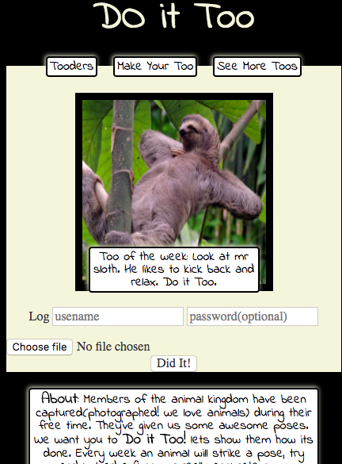

# Do It Too
## Aim
An application made for wee5/6 project for sparta-global. Creating an app demonstrating use of the MVC model having 7 resfull routes.
This has led to the creation of Do It Too
	
## What it Does
A refreshing website thats interactive. A picture based forum that lets users upload pictures (of themselves mainly) mimicking/replicating/demonstrating a photo thats suggested on the page.
users will have the ability to rate other users based on humour or accuracy. They will receive the ability to edit the ratings of other users posts. the ability to delete their own posts too and the ability to look through posts for different pictures

## How to Run
As found the app was developed and version tracked with git and github.
In command line  run the following script to install all necessary files
`git clone git@github.com:Negend/Do-it-Too.git
`

as this app contains some gem dependencies. run the following script to install the required gems

` bundle install `

run command to start the local server and have free use of the app

` shotgun `

## Methods and Tools
### SQL(postgress)
* Table of uploads
  * Upload contains;
  		* id
  		* picture id(secondary key from table or array of picture being mimicked
	
	* user id()
	* rating feature two numbers one increase by 1-5  and the other increasing by 5's a  ratio is represented in percentage)
	* file(picture url) (if pic fails; drop post)

* editable features;
  * Entire post by the user except rating
  * rating editable by other users
* restrictions
   * url must be valid url or file must be valid file
   * rating is 1-5 starting with 5 (buttons with js)
   * no swear words
  
  * extra table for members including their date user name id and password
  * With **absence** of **ActiveRecord** many relationships between members and uploads were made direct to **SQL** 

  This query alone was necssary to show the latest upload for each member id with all its corresponding info
  
		  sql = "SELECT id, user_id, do_it_id, too_file, rating, username,join_date 
				  	FROM (
				  		SELECT t.id, user_id, do_it_id, too_file, rating, username,join_date 
							FROM members m inner join testoos t on m.id  = t.user_id 
							WHERE t.id in (
								SELECT max(t.id) 
		  							FROM members m 
			  						INNER JOIN testoos t 
		  							ON m.id  = t.user_id group by username
		  							)
		  				) y
		  			WHERE user_id = #{id}"
		  
  
### JavaScript
 
A minute amount of javascript has been used. At the moment it controls some css collor changes on hover and changes the inner html of certain labels on click.

Json was the main reason for creating a javascript file which I planned to use to tackle my ratings feature for each upload. This hasnt been done due to time and the level of scope I gave myself for this project time. The json would have passed information on weather the vote had been conted so that javascript can remove click functionality.

### CSS/HTML
The styling as observed on the sight is general for all pages therefore only one stylesheet has been deemed necesarry. with the html the pages have been made quite modular. taking advantage of sinatras ability to find a general layout and yield code from different html pages when called.
Focus of styling was always white background for reading text. Beige nd black theme with square/sqaurish boxes and noticable black borders to give the effect of a framed image. the writing is simple but with a little character to encourage a fun whacky environment for uploaders

### Ruby
Ruby is the main language used. A very clean language.  Approaching the site with the MVC model and the **Sinatra** framework. all folders and files are run from the config.ru
Test coverage was not high therefore ruby gem called **pry** was a very useful debugger for handling numerous errors along the way.
Finding an appropriate picture uploading method was difficult and tricky to implement. With postgress not accepting varbinary datatypes in the database. this was solved by uploading to a public folder. It can be furtther improved by using an **imager** gym and uploading to a cloud. 
Before uploading to the online server **Heroku** the app was run and developed on the a local server using **rack** and **shotgun**

## Features

### MVP
Targets to produce a minimum viable product

* Giving users an abilty to post pictures 
* Give user ability to edit the rating on an upload
* Make it look good
* have uploaded pictures visbile on home page

### Scope

* Make user membership log
* Ability to see all pictures posted by specific user
* Give memembers a different page 
* Make uploads appear with their matching pictures 
* give users option to make password
* allow uploads to be deleted if password is correct
* a page for each tooder with many details on  the post
* variable messages for each upload of the week. giving admin ability to manipulate it

